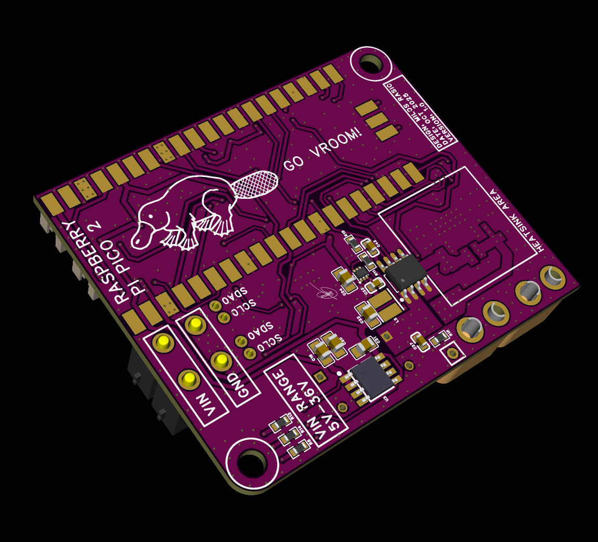

# Building a custom dual motor driver around the RP2350 and DRV8412

This is the long-form companion to the [Element14 Presents](https://www.youtube.com/@Element14presents) episode about the OpenDualMotorDriver — a 4-layer PCB that can drive two brushed DC motors at up to 70 V, sense their currents, read an absolute magnetic encoder, and run closed-loop position and speed control over USB, UART, or I²C. The full video is here:

[](https://www.youtube.com/watch?v=DQ6VGJUASJw)

The goal of the build was to end up with a single board that I could drop into any small robot, gimbal, or test rig and immediately have the four things I keep needing on every project: two real motor outputs, current sensing, encoder feedback, and a clean text protocol I could automate from a host computer. Off-the-shelf driver boards usually give me one or two of those, never all four, so this is the version where I just sat down and did it.

## Why these parts

I picked the **DRV8412** because it is a thermally enhanced dual H-bridge that goes up to 70 V and 6 A continuous per channel without complicated gate-drive circuitry. Each half-bridge takes a single PWM input, the device handles its own dead-time, and the FAULT and OTW open-drain outputs make it easy to detect a problem from a microcontroller. For a hobby-grade project where I want to push a few amps through the motors of a small robot, that is hard to beat.

I picked the **RP2350** (specifically the Raspberry Pi Pico 2 module) for compute. The PIO-capable RP2 family is a known quantity for me, the dual-core makes it easy to keep the control loop deterministic on one core and host I/O on the other, and the Earle Philhower Arduino core is mature enough that I do not need to fight the toolchain. The Pico 2 module also lets me ship the design as a 4-layer board without trying to fan-out a QFN56 myself.

For sensing I used **two ACS722** hall-based current sensors, one in series with each H-bridge output. They are isolated, give me a clean ±5 A range with plenty of headroom for inrush, and they map straight onto the RP2350's ADC at 1650 mV zero / 132 mV/A. There is a 100 k / 10 k divider on the bus voltage so the same ADC can read VIN.

For position I went with the **AS5600** magnetic encoder. It is a 12-bit absolute angle sensor that talks I²C, costs almost nothing, and only needs a diametrically magnetized magnet on the motor shaft. With a software unwrap I get multi-turn position out of it, and that turns out to be more than enough resolution for 4 ms control of a brushed DC motor.

The status LED is a **PCA9633** RGB driver on the same I²C bus as the encoder, and the I²C pull-ups on both buses are software-switchable through MOSFETs so I can play nicely with downstream sensor add-ons that bring their own pull-ups.

## The board

The PCB is 4 layers: top copper, two internal ground planes, and bottom copper. The two ground planes between the signal layers is overkill for a board this size, but it gives me a quiet reference for the ADCs and lets me route the high-current loops on the top layer with minimal coupling into the digital section.

There are three logical blocks on the schematic:

1. **Power electronics** — the input connector, the bulk capacitance, and the DRV8412's PVDD/GVDD/AVDD rails. This is the one section where the layout matters more than the schematic. I kept the bulk caps right at the DRV8412 pads, the DC link short and fat, and the motor return paths flowing straight back to the bulk caps without crossing through the digital ground.

2. **Motor driver and sensing** — the DRV8412 itself, the four PWM inputs (one per half-bridge), the per-bridge reset lines, the ACS722 sensors, and the motor connectors. Each ACS722 sits in series with one motor output so the firmware can read both the current and direction unambiguously.

3. **Compute and IO** — the Pico 2 carrier, AS5600 encoder header, PCA9633 status LED, software-switched I²C pull-ups, a UART header, an SPI header (routed to the connector but unused in firmware today), and an I²C slave port. The slave port is the one I use the most: it lets me drop the driver into a system that already has a host MCU and just talk to it like any other I²C peripheral.

Schematic exports for each of those blocks live under `Hardware/Schematics/`, and layer-by-layer renders plus 3D views live under `Hardware/PCB-Renders/`.

## The firmware

The firmware is a small Arduino sketch that wires together a handful of single-purpose classes. I deliberately kept it readable rather than clever, because this is the kind of board you come back to a year later and need to remember how it works.

```
PicoDualMotorDriver.ino
├── BoardConfig.h            ─ pinout, baud rates, PWM/PID/IO defaults
├── DualMotorController      ─ DRV8412 enable, PWM, faults, ADC
├── As5600Encoder            ─ I²C reads, multi-turn unwrap, filtered velocity
├── PidController            ─ header-only PID with anti-windup
├── ClosedLoopController     ─ cascaded position → speed → output
├── CommandProcessor         ─ ASCII + binary parsers, I²C slave, reports
└── StatusLed                ─ PCA9633 idle / active / fault patterns
```

A few design choices that turned out to matter:

- **`BoardConfig.h` is the only place magic numbers live.** Pinout, PWM frequency, baud rates, ADC reference, current sensor zero and sensitivity, default PID gains, fault holdoff, and so on are all `constexpr` values in a single namespace. When I want to retune the board I edit one file.

- **PWM duty is capped at 95%.** The DRV8412 needs the bootstrap caps to refresh, so I never drive a half-bridge fully on. The `PWM_ACTIVE_MAX = 950` over a 1000-step range gives me clean operation up to motor stall without starving the bootstrap.

- **The closed-loop period is 4 ms, not 1 ms.** I started with 1 ms but the velocity estimate from the encoder picked up too much quantization noise at that rate. Moving to 4 ms (and tuning the velocity filter alpha to 0.40) gave me a much smoother speed signal at no real cost — a brushed DC motor's mechanical bandwidth is well under 250 Hz anyway.

- **Position control is cascaded.** The position PID's output is a speed reference, which then feeds the speed PID, which then produces a permille output to the bridge. You get nice, predictable behavior — the position loop tells the speed loop "go this fast", the speed loop closes around that, and you tune them independently.

- **Manual drive always wins.** If the loop is in speed or position mode and you send a manual command (`M203` / `G1` / `M3` / `M4`) for the bridge that owns the loop, the firmware drops back to manual mode and resets the loop. That has saved me from "why is the motor still spinning?" panic more than once.

- **Three transports, one command set.** The same ASCII and binary commands work on USB CDC, on UART, and on the I²C slave at `0x16`. The only thing I²C cannot do is push a periodic stream — so periodic text/binary reports are USB/UART only, and I²C clients poll instead.

The full ASCII and binary command list is documented separately in [`../Firmware/API_REFERENCE.md`](../Firmware/API_REFERENCE.md), including the 46-byte binary status payload, the binary error codes, and worked sequences for manual drive, speed PID, position PID, and re-zeroing the encoder.

## The desktop GUI

There is a small PySide6 desktop application under `Software/gui/`. It is not necessary — everything works from a serial terminal — but it makes tuning much faster.

The GUI gives me:

- a connection bar where I can pick the serial port and baud rate;
- two manual drive sliders, one per H-bridge, with permille readout;
- live oscilloscope-style plots of VIN, per-bridge currents, and per-bridge commanded power;
- fault / OTW / status-LED indicators that mirror the firmware status flags;
- a closed-loop tab with mode selector, reference fields in counts/rpm/degrees/turns, PID gain entry, and a "zero current position" button (`M210`).

When I am tuning a new motor I usually run the GUI on one monitor and a Jupyter notebook on the other — the notebook talks to the same firmware over the I²C slave port through a USB-to-I²C bridge, so I can step references and capture data without taking USB away from the GUI.

## What I would change next

A few things I want to revisit when I cut a v2 board:

- **Make VIN sensing single-ended differential.** The current 100 k / 10 k divider is fine for 24 V supplies but the noise floor gets worse at higher VIN. A proper differential amplifier would help.
- **Use a TMP235 or PT1000 next to the DRV8412 pad.** The OTW input gives me a binary "things are too hot" signal, but I would like an actual temperature.
- **Break the I²C slave out to an isolated header.** Right now the slave port shares the same ground as the rest of the board, which is fine for benchtop but limiting for distributed systems.

If you build the board and end up making any of those changes — or anything else — please open an issue or send a pull request. The firmware modules are deliberately small enough that a focused PR is easy to review.

## License and credits

The firmware and GUI are MIT-licensed; the hardware files (`Hardware/` directory) are released under CERN-OHL-S v2. See the top-level `LICENSE` and `LICENSE-HARDWARE` files in the repository for the full notices.

Designed and built by [Miloš Rašić](https://github.com/MilosRasic98) for [Element14 Presents](https://www.youtube.com/@Element14presents).
