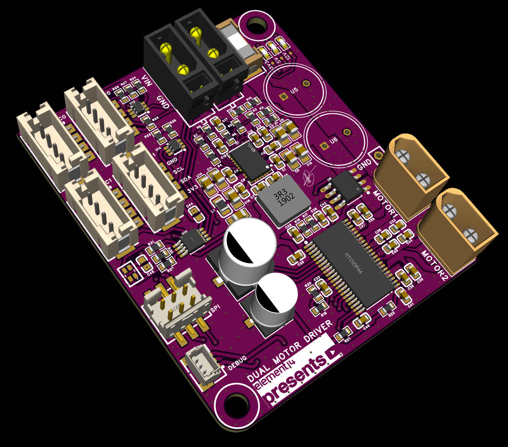
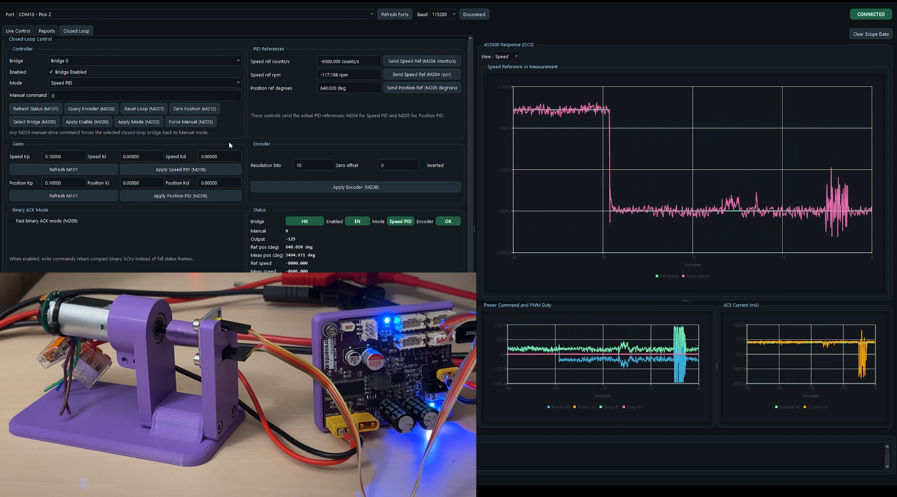
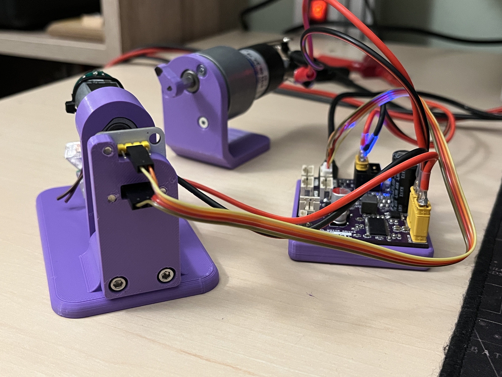
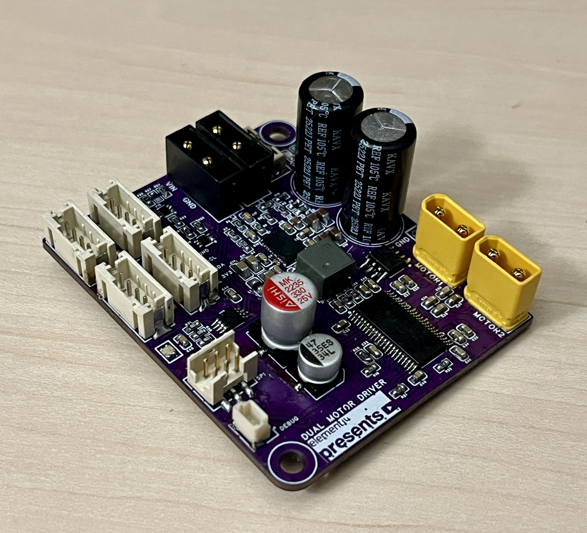
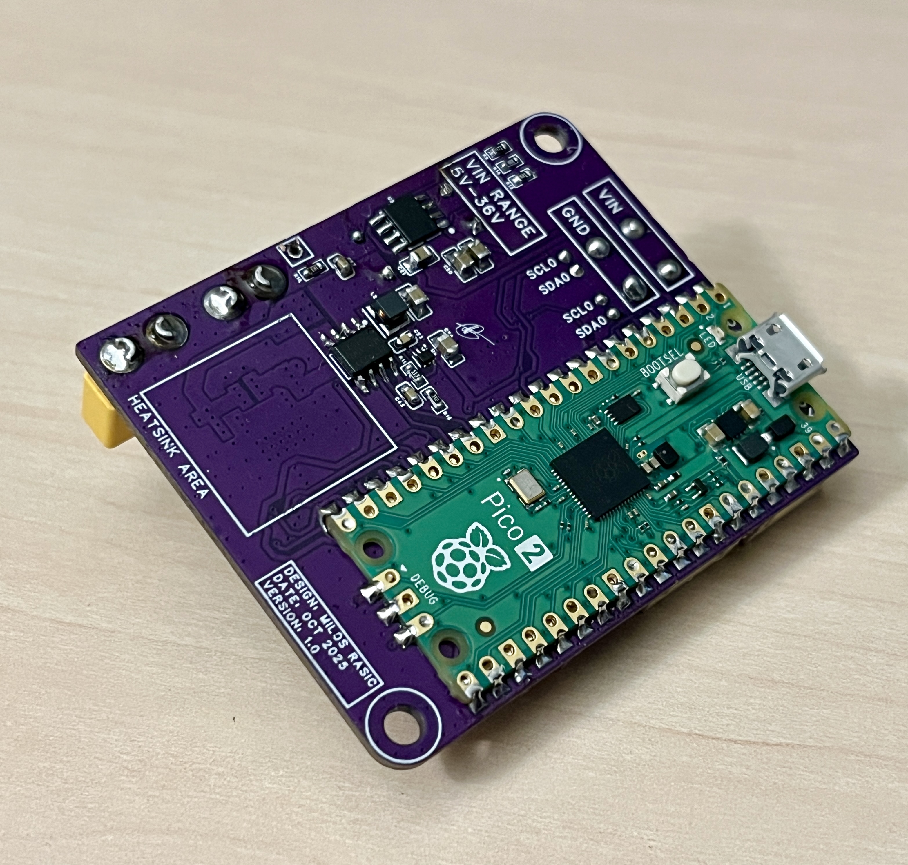

# OpenDualMotorDriver


OpenDualMotorDriver is an open-source, compact (50x60 mm) dual H-bridge brushed DC motor driver built around the Raspberry Pi RP2350 and the Texas Instruments DRV8412. It runs two motors successfully from 4 V to 40 V (tested up to 31V), monitors per-bridge current with ACS722 hall sensors, reads angles from an AS5600 magnetic encoder, and exposes a full ASCII + binary command API over USB, UART, and I²C. A desktop PySide6 GUI is included for live tuning, telemetry plotting, and closed-loop PI/PID control of position and speed.

## Specs


-purple)

Designed to be an all-in-one solution for a wide array of robotics projects, it includes:
1. Dual brushed DC motor driving capability (both outputs can be tied to a single bigger motor)
2. Single power supply operation
3. Wide voltage input range (4V - 40V)
4. Current hall effect sensors for both motors
5. Daisy chaining connectors for both power and I2C
6. Small form factor (50x60 mm)
7. Connectors for adding new sensors



This project was originally created for the [Element14 Presents](https://www.youtube.com/@Element14presents) YouTube channel. 

The video walkthrough is here: [Custom Dual Motor Driver — Element14 Presents](https://www.youtube.com/watch?v=DQ6VGJUASJw).

Blog about the video on [Element14 Community Blog](https://community.element14.com/challenges-projects/element14-presents/project-videos/w/documents/72060/designing-a-more-capable-dual-motor-driver-beyond-the-l298n-what-worked-and-what-didn-t?ICID=I-HP-DESIGNING-A-MORE-CAPABLE-DUAL-MOTOR-APR26).

Google Sheet Link - BOM, Errata, and Requirement List: [Dual Motor Driver Sheet](https://docs.google.com/spreadsheets/d/1Zc9ybkn5q93EQncn_3QRWnhDOZEBM622GhTFV9P49-4/edit?usp=sharing)

## Current Project Features

- **Dual H-bridge** based on the DRV8412 in PWM mode (95% duty cap, 20 kHz switching).
- **RP2350** dual-core MCU (Pico 2 module) running the firmware in the Arduino core.
- **Per-bridge current sensing** with two ACS722 hall sensors.
- **Bus voltage monitoring** through a 100 k / 10 k divider on the RP2350 ADC.
- **Magnetic encoder support** via an AS5600 on I²C0 with multi-turn position tracking.
- **Closed-loop control** with cascaded position → speed → output PIDs running at a 4 ms control period.
- **Three host transports**: USB CDC, UART, and an I²C slave at `0x16`. The same ASCII and binary command set is accepted on every port.
- **Status RGB LED** driven by a PCA9633 with distinct idle, active, and fault patterns.
- **Software-switched I²C pull-ups** on both buses for clean integration with sensor add-ons.
- **Desktop GUI** (PySide6) with manual drive sliders, live oscilloscope-style plots, and a closed-loop tuning tab.





## Repository structure

```
OpenDualMotorDriver/
├── Hardware/                # Schematics, gerbers, PCB renders, BOM
├── Firmware/                # Arduino firmware for the RP2350 + API reference
│   ├── API_REFERENCE.md
│   └── PicoDualMotorDriver/
├── Software/
│   └── gui/                 # PySide6 desktop GUI and serial protocol layer
├── Docs/
│   └── blog-post.md         # Long-form write-up of the build
├── Images/                  # Photos and 3D renders
├── LICENSE                  # MIT, applies to firmware and host software
└── setup_repo.ps1 / .sh     # Helper that copies the source files into this layout
```

## Hardware

The board is a 4-layer PCB built around three logical sections:

1. **Power electronics** — input filtering, bulk capacitance, and the DRV8412 bridge driver block. The DRV8412 is operated in PWM mode with one PWM line per half-bridge and a shared reset line per H-bridge pair.
2. **Sensing and protection** — two ACS722 hall current sensors in line with each H-bridge output, a divider feeding the VIN ADC, and the DRV8412 fault and OTW open-drain inputs pulled up to 3.3 V on the RP2350.
3. **Compute and IO** — a Raspberry Pi Pico 2 (RP2350) module, AS5600 magnetic encoder on I²C0, PCA9633 RGB status LED on I²C0, software-switched I²C0/I²C1 pull-ups, a UART header, an SPI header (routed but unused in firmware), and an I²C slave port.

PCB renders, gerber files, the schematic PDF/PNG exports, and the bill of materials live under `Hardware/`. The BOM is provided as both `.xlsx` and `.csv`.





## Firmware

The firmware is an Arduino sketch (`Firmware/PicoDualMotorDriver/PicoDualMotorDriver.ino`) targeting the [Earle Philhower RP2040/RP2350 core](https://github.com/earlephilhower/arduino-pico). Code is organized into single-responsibility classes:

| File | Responsibility |
|---|---|
| `BoardConfig.h` | Pinout and tunable defaults — change here, not in business logic. |
| `DualMotorController.{h,cpp}` | DRV8412 bridge enable/disable, PWM duty calculation, fault/OTW handling, ADC sampling, current and VIN conversion. |
| `As5600Encoder.{h,cpp}` | AS5600 register access, multi-turn unwrapping, filtered velocity estimate. |
| `PidController.h` | Header-only PID with integral clamp and conditional anti-windup. |
| `ClosedLoopController.{h,cpp}` | Cascaded position → speed → output controller, mode/state machine, snapshot for telemetry. |
| `CommandProcessor.{h,cpp}` | ASCII parser, binary frame parser, I²C slave glue, periodic text/binary report streamer. |
| `StatusLed.{h,cpp}` | PCA9633 driver, idle/active/error blink patterns. |
| `PicoDualMotorDriver.ino` | Wires the modules together and runs the main loop. |

Defaults that matter in practice:

- USB and UART baud: `115200`
- I²C slave address: `0x16`
- AS5600 address: `0x36`
- PCA9633 address: `0x62`
- PWM frequency: `20 kHz`, active duty capped at `95%`
- Closed-loop period: `4 ms`
- Manual command range: `±1000 permille` (i.e. `±100.0%`)
- Speed reference range: `±262144 counts/s` (`±3840 rpm`)
- Position reference range: `±1,000,000 counts` (about `±244 turns`)

The full ASCII and binary command API — including `M-codes`, binary opcodes, status payload layout, and error codes — is documented in [`Firmware/API_REFERENCE.md`](Firmware/API_REFERENCE.md).

### Building and flashing

1. Install the [Arduino IDE](https://www.arduino.cc/en/software) (1.8.x or 2.x).
2. Add the [Earle Philhower RP2040/RP2350 board manager URL](https://github.com/earlephilhower/arduino-pico) in *File → Preferences → Additional Board Manager URLs*:
   ```
   https://github.com/earlephilhower/arduino-pico/releases/download/global/package_rp2040_index.json
   ```
3. From *Tools → Board → Boards Manager*, install **Raspberry Pi Pico/RP2040/RP2350**.
4. Open `Firmware/PicoDualMotorDriver/PicoDualMotorDriver.ino`.
5. Select board **Raspberry Pi Pico 2** (or your equivalent RP2350 module).

The firmware prints a banner on USB and UART after boot. Send `M100` for help.

## Desktop GUI

`Software/gui/` contains a PySide6 GUI that talks to the firmware over USB serial:

```bash
cd Software/gui
pip install -r requirements.txt
python pico_motor_driver_gui.py
```

Useful flags:

```bash
python pico_motor_driver_gui.py --port COM5 --baud 115200 --window 60
```

The GUI exposes manual-drive sliders, fault and OTW indicators, current and VIN gauges, the periodic binary status stream, and a closed-loop tab for editing speed/position PIDs and setting references. PySide6 already pulls in the serial and chart modules used here, so no separate `pyserial` install is needed.

## Quick start checklist

1. Power the board from a 4-40 V supply rated for your motor stall current.
2. Connect the brushed DC motor leads to the H0 and H1 outputs.
3. Plug in the AS5600 magnet on the motor shaft (only required for closed-loop modes).
4. Connect USB to your computer and launch the GUI, or open a serial terminal at 115200 baud.
5. Send `M200 H0 S1` to enable bridge 0, then `M203 H0 S250` to drive at 25%.
6. For position control, see the minimal sequences at the end of [`Firmware/API_REFERENCE.md`](Firmware/API_REFERENCE.md).

## Disclaimer

OpenDualMotorDriver is a hobby and educational project. It is not a certified industrial motor controller. Brushed DC motors at the voltages and currents this board is rated for can move heavy loads, generate large back-EMF spikes, and cause injury. Only operate it with proper fusing, current limiting, mechanical shielding, and emergency-stop procedures appropriate for your test setup. The author and Element14 are not responsible for any damage to equipment, motors, batteries, or persons resulting from use of this design.

## Credits

Designed and documented by [Miloš Rašić](https://github.com/MilosRasic98) for the [Element14 Presents](https://www.youtube.com/@Element14presents) program.

If you build the board, fork the design, or write firmware on top of it, I would love to hear about it — open an issue or send a PR.
